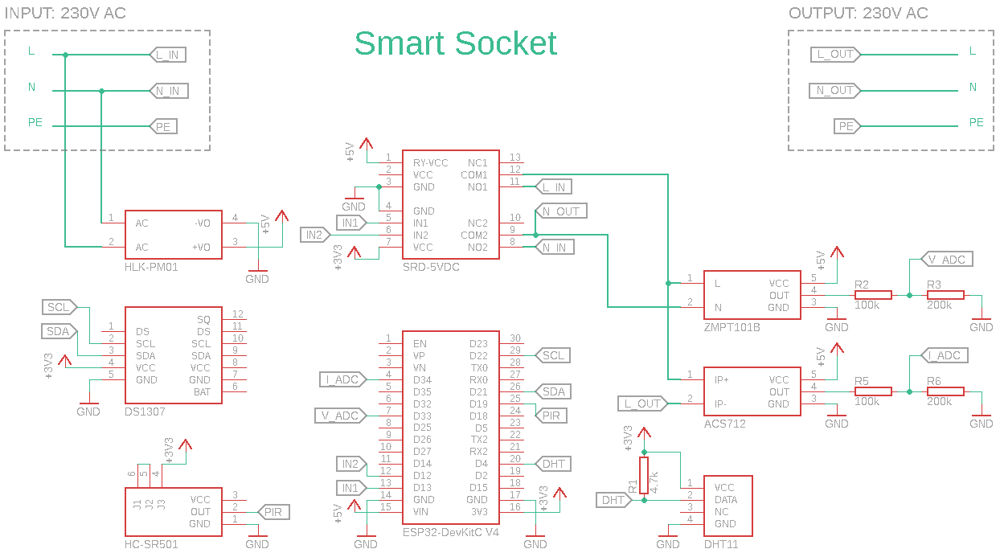
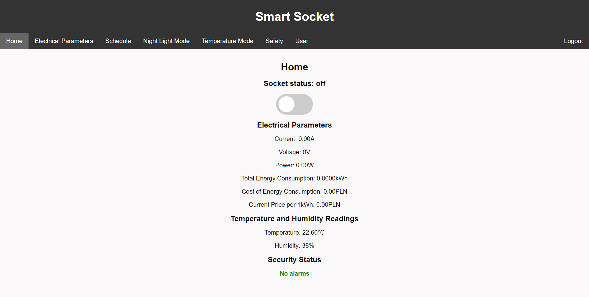
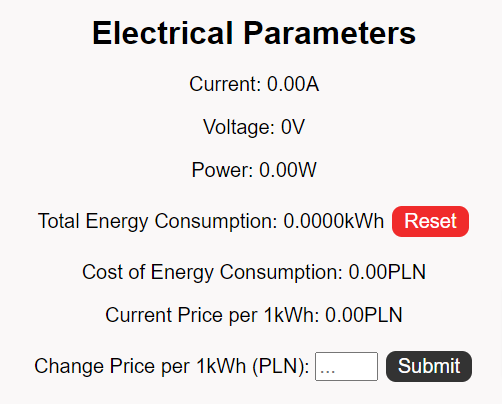
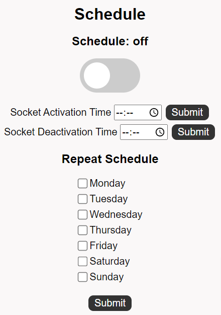
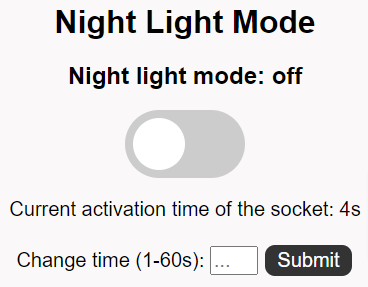
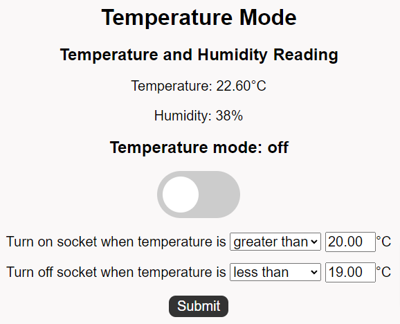
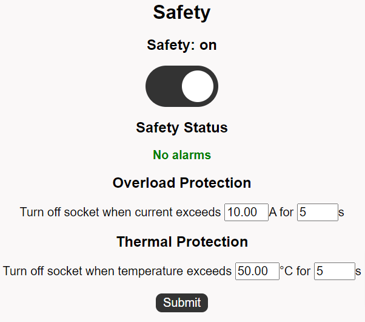
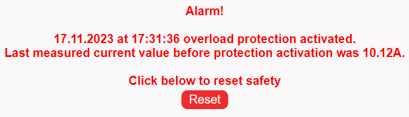
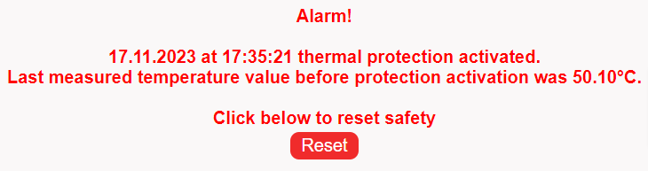
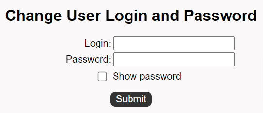

# Smart Socket
## Table of contents
- [About The Project](#about)
- [Getting Started](#getting_started)
    - [Hardware Requirements](#hardware)
    - [Circuit Diagram](#circuit)
    - [Software Requirements](#software)
- [Features](#features)
    - [Remote Control via Wi-Fi](#remote)
    - [Energy Monitoring](#energy-monitoring)
    - [Schedule Configuration](#schedule)
    - [Night Light Mode](#night_light_mode)
    - [Temperature Mode](#temperature_mode)
    - [Safety Configuration](#safety)
    - [User Profile](#user)
- [License](#license)
## About The Project {#about}
The Smart Socket project aims to create an intelligent socket based on the ESP32 microcontroller. The goal is to design a versatile socket that enables remote control, measurement and data transmission.
## Getting Started {#getting_started}
In this section you will find required hardware components and necessary software to start Smart Socket project.
#### Hardware Requirements {#hardware}
| Component                       | Description                      |
|--------------------------------|----------------------------------|
| Hi-Link HLK-PM01      | 5VDC Power supply unit                |
| ESP32          | Low-power system on a chip with integrated Wi-Fi                 |
| SRD-05VDC                | Relay Module |
| ACS712-20A       | Current Sensor          |
| ZMPT101B               | Voltage Sensor                   |
| DHT11  | Temperature and Humidity Sensor |
| HC-SR501     | PIR Motion Sensor                   |
| DS1307        | Real-Time Clock     |
| 4.7kΩ Resistor        | DHT11 pull-up resistor   |
| 2x100kΩ Resistor        | Divide voltage for measurement  | 
| 2x200kΩ Resistor        | Divide voltage for measurement   |

#### Circuit Diagram {#circuit}

     

#### Software Requirements {#software}
- [Arduino IDE](https://www.arduino.cc/en/software) or [PlatformIO](https://platformio.org/) or any IDE that can be used to program ESP32.
- [CP210x](https://www.silabs.com/developers/usb-to-uart-bridge-vcp-drivers?tab=downloads)  driver for Computer (This is a driver that allows you to communicate with ESP32 via USB).
## Features
#### Remote Control via Wi-Fi {#remote}
Users can control the socket remotely through a web interface.

     

#### Energy Monitoring {#energy-monitoring}

The smart socket provides real-time insights into energy consumption, including current, voltage, active power consumption, and total energy usage. This data enables users to analyze their electricity usage patterns, optimize consumption, and ultimately reduce costs.

     

#### Schedule Configuration {#schedule}
The "Schedule" tab allows users to set up on/off schedules for the smart socket based on specific hours and days of the week, utilizing the precision of the RTC DS1307 clock to maintain accurate timekeeping even in the absence of power supply.

     

#### Night Light Mode {#night_light_mode}
The "Night Light Mode" enables users to set up the socket to activate upon motion detection by the PIR HC-SR501 sensor. This feature, named for its primary function of providing nighttime illumination, allows users to customize the duration for which the smart socket remains activated after motion is detected, thus creating an efficient night light tailored to individual preferences.

     

#### Temperature Mode {#temperature_mode}
The "Temperature Mode" allows users to define the logic for turning the smart socket on and off based on ambient temperature values. This feature serves as a versatile tool suitable for both heating and cooling purposes within a room, utilizing connected devices to regulate temperature efficiently.

     

#### Safety Configuration {#safety}
The "Safety" page enables users to configure overload and thermal protections. Implementing these safety measures in the smart socket prevents overloads and excessive heating, minimizing the risk of electrical damage and fires.

     

The screenshots below depict alarm messages indicating the activation of protections, corresponding to overload and thermal protections. These messages include the date and time of the protection activation, as well as the last recorded measurement data before the protection triggered. This allows users to promptly understand the cause of the alarm and take appropriate steps to resolve the issue. The occurrence of any alarm message results in the immediate shutdown of the smart socket and deactivation of all activated modes.

     

     

#### User Profile {#user}
The "User" tab allows users to modify the login credentials required to access the "Smart Socket" webpage. 

     

## License {#license}
Distributed under the MIT License. See `LICENSE.txt` for more information.